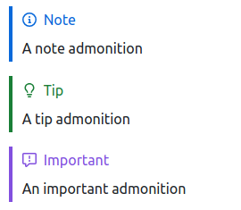
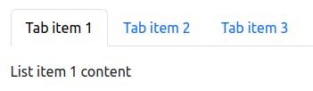

# zenstruck/commonmark-extensions

## Installation

```bash
composer require zenstruck/commonmark-extensions
```

## GFM Admonitions (Notes)



The `AdmonitionExtension` adds support for [GFM style admonitions](https://github.com/orgs/community/discussions/16925).

Enable the extension:

```php
use League\CommonMark\Environment\Environment;
use Zenstruck\CommonMark\Extension\GitHub\AdmonitionExtension;

/** @var Environment $environment */

$environment->addExtension(new AdmonitionExtension());
```

The following markdown:

```markdown
> [!NOTE] <!-- Can also use "TIP", "IMPORTANT", "WARNING", "CAUTION" -->
> Admonition content...
```

Renders as:

```html
<blockquote class="md-admonition md-admonition-note" role="alert">
    <p class="md-admonition-label">Note</p>
    <p>
        Admonition content...
    </p>
</blockquote>
```

> [!NOTE]
> See [this sample CSS file](doc/github-admonitions.css) to style the admonitions similar to GitHub.

## Tabbed Content



The `TabbedExtension` adds support for "tabbed" content.

Enable the extension:

```php
use League\CommonMark\Environment\Environment;
use Zenstruck\CommonMark\Extension\TabbedExtension;

/** @var Environment $environment */

$environment->addExtension(new TabbedExtension());
```

The following markdown:

```markdown
- ===Tab item 1

  List item 1 content

- ===Tab item 2

  Tab item 2 content

- ===Tab item 3

  Tab item 3 content

  more content
```

Renders as:

```html
<div class="md-tabbed">
    <ul class="md-tabbed-tabs" role="tablist">
        <li class="md-tabbed-tab" role="presentation">
            <button id="tabs-215c2f4381-tab-0" class="md-tabbed-tab-trigger active" type="button" role="tab" aria-selected="true" aria-controls="tabs-215c2f4381-panel-0">Tab item 1</button>
        </li>
        <li class="md-tabbed-tab" role="presentation">
            <button id="tabs-215c2f4381-tab-1" class="md-tabbed-tab-trigger" type="button" role="tab" aria-selected="false" aria-controls="tabs-215c2f4381-panel-1">Tab item 2</button>
        </li>
        <li class="md-tabbed-tab" role="presentation">
            <button id="tabs-215c2f4381-tab-2" class="md-tabbed-tab-trigger" type="button" role="tab" aria-selected="false" aria-controls="tabs-215c2f4381-panel-2">Tab item 3</button>
        </li>
    </ul>
    <div class="md-tabbed-panels">
        <div id="tabs-215c2f4381-panel-0" class="md-tabbed-panel active" role="tabpanel" tabindex="0" aria-labelledby="tabs-215c2f4381-tab-0">
            <p>List item 1 content</p>
        </div>
        <div id="tabs-215c2f4381-panel-1" class="md-tabbed-panel" role="tabpanel" tabindex="0" aria-labelledby="tabs-215c2f4381-tab-1">
            <p>Tab item 2 content</p>
        </div>
        <div id="tabs-215c2f4381-panel-2" class="md-tabbed-panel" role="tabpanel" tabindex="0" aria-labelledby="tabs-215c2f4381-tab-2">
            <p>Tab item 3 content</p>
            <p>more content</p>
        </div>
    </div>
</div>
```

> [!NOTE]
> The tab and panel ids are randomly generated to avoid conflicts.

> [!NOTE]
> It is up to you to style the tabs and make them interactive. The extension only provides
> the HTML structure.

> [!TIP]
> You can customize the theme as an array passed to `TabbedExtension::__construct()`.
> See `TabbedExtension::THEMES` for details.
>
> A working bootstrap theme is provided. Construct the extension with the
> `TabbedExtension::bootstrapTheme()` named constructor to use.
